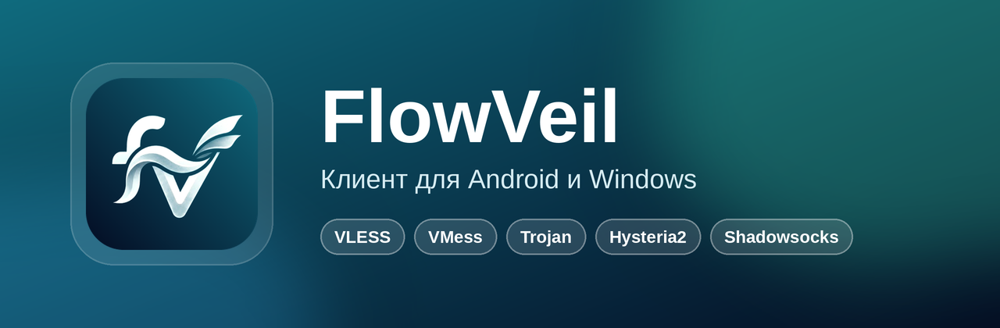

 

**Вставьте ссылку на подписку — и нажмите одну кнопку.**

🌐 **[Сайт FlowVeil](https://xoyzoom-lgtm.github.io/FlowVeil-proxy/)**
Простой и красивый клиент для подключения к серверам по подписке — понимает подписки любых провайдеров.

---

## ⬇️ Скачать

<table>
<tr>
<td align="center" width="50%">

### 📱 Android

[**FlowVeil-android.apk**](https://github.com/xoyzoom-lgtm/FlowVeil-proxy/releases/latest/download/FlowVeil-android.apk)
 подходит для всех телефонов

[FlowVeil-android-arm64.apk](https://github.com/xoyzoom-lgtm/FlowVeil-proxy/releases/latest/download/FlowVeil-android-arm64.apk)
 меньше размер, для современных 64-битных

</td>
<td align="center" width="50%">

### 💻 Windows

[**FlowVeil-Setup.exe**](https://github.com/xoyzoom-lgtm/FlowVeil-proxy/releases/latest/download/FlowVeil-Setup.exe)
 установщик, Windows 10 / 11

[FlowVeil-windows-portable.zip](https://github.com/xoyzoom-lgtm/FlowVeil-proxy/releases/latest/download/FlowVeil-windows-portable.zip)
 без установки

</td>
</tr>
</table>

Уже пользуетесь? Обновления приходят прямо в приложение — **Настройки → Проверить обновления**.

## 🚀 Как начать

1. Скопируйте ссылку на подписку, которую дал ваш провайдер.
2. Откройте FlowVeil и нажмите **«Вставить из буфера»** (или отсканируйте QR-код).
3. Нажмите большую кнопку — готово.

## ✨ Возможности

| | |
|---|---|
| 🔗 **Любые подписки** | Ссылки, base64, Clash / Mihomo (YAML), sing-box и Xray JSON — FlowVeil сам разберётся с форматом |
| 🛰️ **Все популярные протоколы** | VLESS (Reality, XHTTP), VMess, Trojan, Shadowsocks, Hysteria2, TUIC, WireGuard |
| 📊 **Информация о подписке** | Остаток трафика, срок действия, объявление и кнопка поддержки провайдера |
| ⚡ **Лучший сервер** | Одна кнопка проверяет серверы и подключает к самому быстрому |
| 🔁 **Автопереключение** | Если сервер перестал отвечать, FlowVeil сам переходит на рабочий, не разрывая подключение |
| ✅ **Проверка серверов в два шага** | Сначала «работает / не работает», потом пинг — сразу видно, куда подключаться |
| 🔔 **Напоминания** | За 3 дня и за 1 день до конца подписки и когда заканчивается трафик; подписки обновляются сами каждые 6 часов |
| 🇷🇺 **Российские сайты напрямую** | Банки и госуслуги напрямую — одним переключателем |
| ★ **Избранное и тест скорости** | Любимые серверы наверху, скорость в Мбит/с, живая скорость под кнопкой |
| 🔗 **Ссылки-приглашения** | `flowveil://add?url=…` открывает FlowVeil и сразу добавляет подписку |
| 🎨 **17 цветовых тем** | Светлые, тёмные, неоновые — плюс свой код темы |
| 🧩 **Виджеты** | Кнопка 1×1 и карточка со статусом и сервером на главном экране Android |
| 🛡️ **Режим TUN на ПК** | Весь трафик компьютера через сервер, а не только браузер |
| 🔄 **Обновления в одно касание** | Новая версия скачивается и ставится из самого приложения |
| 🔒 **Без аналитики** | Никаких аккаунтов, трекеров и серверов разработчика |

## 🔒 Приватность

FlowVeil ничего не собирает и не отправляет разработчику. Провайдеру подписки передаются только стандартные
заголовки устройства (`x-hwid` и модель), которые нужны панелям с лимитом устройств; на Android это можно отключить.
Подробно — в [политике конфиденциальности](PRIVACY.md).

## ❓ Частые вопросы

<b>Подписка не добавляется / «Не удалось загрузить серверы»</b>

FlowVeil покажет причину. Чаще всего: ссылка открывает сайт, а не подписку (скопируйте ссылку «для приложения»),
провайдер недоступен из вашей сети, или это зашифрованная ссылка `happ://crypt…` — её открывает только приложение Happ,
попросите у провайдера обычную ссылку.

<b>Провайдер пишет, что у меня лишнее устройство</b>

Удалите старое устройство в личном кабинете или боте провайдера. В новых версиях FlowVeil ID устройства
не меняется после переустановки.

<b>Как дать пользователям ссылку, которая сразу добавляет подписку?</b>

Сделайте ссылку вида `flowveil://add?url=` + ссылка на подписку (лучше закодированная, как в адресной строке).
На Android и Windows она откроет FlowVeil и добавит подписку, серверы загрузятся сами.

<b>Windows предупреждает о неизвестном издателе</b>

Установщик пока не подписан сертификатом. Нажмите «Подробнее» → «Выполнить в любом случае».
Исходный код открыт, а сборки делает GitHub Actions прямо из этого репозитория.

## 💬 Связь

Вопросы и предложения — в Telegram [@GxoyzoomG](https://t.me/GxoyzoomG).

---

<b>Для разработчиков</b>

- `android/` — форк [2dust/v2rayNG](https://github.com/2dust/v2rayNG)
- `windows/` — форк [2dust/v2rayN](https://github.com/2dust/v2rayN); локальная сборка: `windows/BUILD-FlowVeil.bat`
- Сборка и релиз — `.github/workflows/build.yml`, каждый пуш в `main` публикует новую версию.
- Подпись APK берётся из секретов `HUPP_KEYSTORE_BASE64` (alias `hupp`) и `HUPP_KEYSTORE_PASSWORD`.

FlowVeil основан на <a href="https://github.com/2dust/v2rayNG">v2rayNG</a> и <a href="https://github.com/2dust/v2rayN">v2rayN</a> · распространяется по лицензии GPL-3.0

